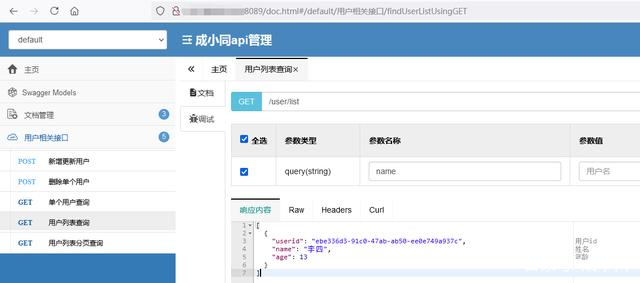

如何使用docker部署springboot项目播报文章

成小同

2021-07-12 23:46
关注
下面几篇文章完成了springboot、mybatis-plus、mysql、swagger的集成开发。

springboot+mybatis-plus+mysql实例

MyBatis-plus代码生成器生成的实体不包含@TableId,@TableName

springboot集成swagger入门实例

本文将在以上文章的基础上完成。

1、制作jar文件

双击下图中右侧中的"package"生成jar文件，生成的jar文件位于图中左侧位置。

2、Dockerfile文件编写如下

3、将生成的demo-0.0.1-SNAPSHOT.jar和Dockerfile文件上传到服务器。

4、使用命令制作镜像。docker build -t xiaotongdemo .
-t xiaotongdemo：镜像的标签为xiaotongdemo

5、查看生成的镜像。docker images | grep xiaotong

6、运行镜像，启动容器。docker run --name xiaotongdemo -d -p 8089:8089 xiaotongdemo

--name xiaotongdemo：容器的名称为xiaotongdemo

-d：后台运行容器

-p 8089:8089：指定端口映射，主机端口：容器端口

7、查看启动的容器。docker ps | grep xiaotong

8、浏览器输入http://http://ip:port/doc.html，访问swagger。

9、如何查看日志。

登录容器内部。docker exec -it b213eca52cd4 /bin/bash

-it：容器中开启一个交互模式的终端。

接下来就和平时查看日志一样了。找到日志存放的目录，使用tail命令查看。tail -f demo.log